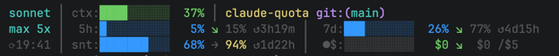
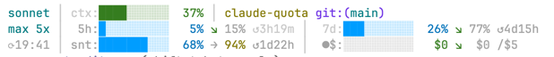

# claude-quota

Compact, quota-focused statusline plugin for Claude Code. Shows all usage buckets at a glance — no
more visiting the usage page.

## What you see





```
sonnet high │ ctx:██░░░░░░░░  23% │ lakelab git:(main*)
max 5x      │  5h:██░░░░░░░░  17% ↗139% ◔3h56m │  7d:██░░░░░░░░  23% ↘  76% ◔4d20h
⟳18:01      │ snt:██████░░░░  63% → 91% ◕2d3h  │  ●$:░░░░░░░░░░   $0 ↘  $0 /$5
```

### Segments

**Line 1**

| Segment               | Meaning                                         |
|-----------------------|-------------------------------------------------|
| `sonnet high`         | Model family + effort level                     |
| `ctx:██░░░░░░░░  23%` | Context window: 10-char bar + right-justified % |
| `lakelab`             | Project directory (last path segment)           |
| `git:(main*)`         | Git branch, `*` = dirty working tree            |

**Quota segments** (lines 2 & 3 at rows ≥ 3; merged onto one line at rows = 2)

| Segment                         | Meaning                                                                                 |
|---------------------------------|-----------------------------------------------------------------------------------------|
| `max 5x`                        | Plan name + multiplier (lowercase)                                                      |
| `5h:` / `7d:` / `snt:` / `ops:` | Quota labels (5h session, 7d all-models, 7d Sonnet, 7d Opus)                            |
| `█████░░░░░`                    | 10-char bar per metric                                                                  |
| ` 17%`                          | Current utilization, right-justified to 4 chars                                         |
| `↘ 32%` / `→ 90%` / `↗140%`     | Pace glyph + projected end-of-window utilization; >100% means you will exceed the quota |
| `◔3h56m`                        | Time until quota resets; glyph shows window progress: `○◔◑◕●` = 0→100% elapsed         |
| `⟳18:01`                        | Local time of last usage data fetch (shown in col-0 of line 3)                          |
| `●$:` / `○$:`                   | Extra usage enabled (`●`) or disabled (`○`)                                             |
| `  $0 ↘  $0 /$5`                | Current spend · pace glyph · projected · monthly limit (all fixed-width, aligned)       |

### Color coding

- **Context bar**: green < 70% → yellow 70–85% → red ≥ 85%
- **Quota bars (filled `█`)**: blue < 75% → magenta 75–90% → red ≥ 90%. When over pace, up-to-pace portion is dim; over-pace portion is bright so excess stands out
- **Quota bars (empty `░`)**: dim = projected path · gray = wasted quota (projected < 100%) · red = quota will run out (projected ≥ 100%)
- **Pace glyph**: green `↘` under-pace · dim `→` on-pace · yellow/red `↗` over-pace
- **Projected**: dim ≤ 79% · yellow 80–100% · red > 100%
- **Money**: green $0 · yellow > $0 · red ≥ 80% of limit

## Install

### Option A: npm (recommended)

```bash
npm install -g @mmdemirbas/claude-quota
```

Then configure the statusline in `~/.claude/settings.json`:

```json
{
  "statusLine": {
    "type": "command",
    "command": "claude-quota"
  }
}
```

### Option B: from source

```bash
git clone https://github.com/mmdemirbas/claude-quota.git
cd claude-quota
npm install
./run install
```

`./run install` builds the project and links it as the global `claude-quota` binary.
Subsequent `./run build` calls take effect immediately — no re-install needed.

Configure the statusline:

```json
{
  "statusLine": {
    "type": "command",
    "command": "claude-quota"
  }
}
```

## Requirements

- macOS (Keychain credential reading)
- Node.js ≥ 18
- Claude Code with an active Pro/Max subscription (OAuth login)
- API key users: usage data is unavailable; the quota line is skipped

## How it works

1. Claude Code invokes the plugin as a subprocess, piping context JSON on stdin
2. Plugin reads your OAuth token from macOS Keychain (same credential as Claude Code itself)
3. Calls `api.anthropic.com/api/oauth/usage` — response cached 2 min (hard TTL); after 45 s a
   background refresh is triggered so data stays current during long sessions
4. Renders 1–3 lines to stdout, adapting to terminal width and height

## Adaptive layout

The output adapts to the terminal width and height so it never wraps or garbles.

**Height tiers** (rows available):

| Rows | Layout |
|------|--------|
| ≥ 3 | Full 3-line layout (default) |
| 2 | Line 1 unchanged · Line 2 flattens all quotas (5h + 7d + snt + ops + $) |
| 1 | Single line: `model │ ctx% │ 5h% │ 7d%` — compact, no bars |

**Width tiers** (applied per-line, degrading until the line fits):

| Tier | Content per quota |
|------|-------------------|
| Full | bar + pct + pace glyph + projected% + reset timer |
| No-reset | drop reset timer |
| No-pace | drop pace glyph + projected% |
| Compact | label + pct only (no bar) |

Line 1 git info follows the same tier order: `project + branch*` → `project` → omitted.

Terminal dimensions are read from `process.stderr` (stays attached to the TTY even when stdout is piped), then `$COLUMNS`/`$LINES`, then defaults (120×3).

## Replacing claude-hud

If you use `claude-hud`, disable it first to avoid a crowded statusline:

```json
{
  "enabledPlugins": {
    "claude-hud@claude-hud": false
  }
}
```

## Troubleshooting

**No quota line appears** — you may be an API key user, on a free plan, or on a custom
`ANTHROPIC_BASE_URL`. The plugin only fetches usage for direct Claude.ai OAuth subscribers.

**`usage:⚠` shown** — the API is unreachable (network error, timeout). Cached data is shown for 15
s, then the warning appears.

**`⟳` indicator** — you hit a rate limit on the usage API. Last-known data is shown with exponential
backoff (60 s → 5 min). The `⟳` clears once a fresh fetch succeeds.

**Warning `[claude-quota] cache file rejected ... reason=permissive-mode`** — an old cache file
was written before the permission hardening shipped. The plugin refuses to read files with group
or world permission bits and re-fetches; the warning clears after the next successful fetch writes
a fresh `0600` cache. Set `CLAUDE_QUOTA_SILENT=1` to suppress the line if you prefer.

## Security model

- **Credential source**: the OAuth token is read from the macOS Keychain first, with
  `~/.claude/.credentials.json` as a fallback on non-macOS hosts. The fallback file is refused
  unless it is `0600` and owned by the current user, so a token planted by another local user
  cannot be consumed.
- **Cache files**: `data.js`, `credit-grant.js`, `.profile-cache.json`, and `dashboard.html` live
  under `~/.claude/plugins/claude-quota/` with mode `0600`. The renderer refuses to read cache
  files with broader modes, which prevents a second local user from poisoning the dashboard input.
- **Dashboard output**: all externally-sourced strings (currently the plan name) are HTML-escaped
  before being inserted into `dashboard.html`. A tampered API response cannot execute script in
  the dashboard page.
- **HTTPS**: calls to `api.anthropic.com` use Node's default system trust store with a minimum
  TLS version of `TLSv1.2`. Anthropic's leaf certificate is NOT pinned because Anthropic rotates
  it without publishing a pin set — a hardcoded pin would eventually cause a hard outage. This
  means an attacker with the ability to install a trusted CA on the host (root, admin, or a
  corporate MDM profile) can intercept API traffic. The `0600` cache files and the HTML escaping
  above are the defence-in-depth against a successful intercept.
- **Stderr warnings**: auth failures (HTTP 401/403), rejected cache files, and rejected
  credential files emit a single-line warning to stderr. Rate limits and normal expiry stay
  silent. Set `CLAUDE_QUOTA_SILENT=1` to disable all warnings.
