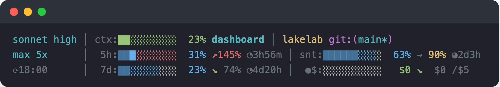
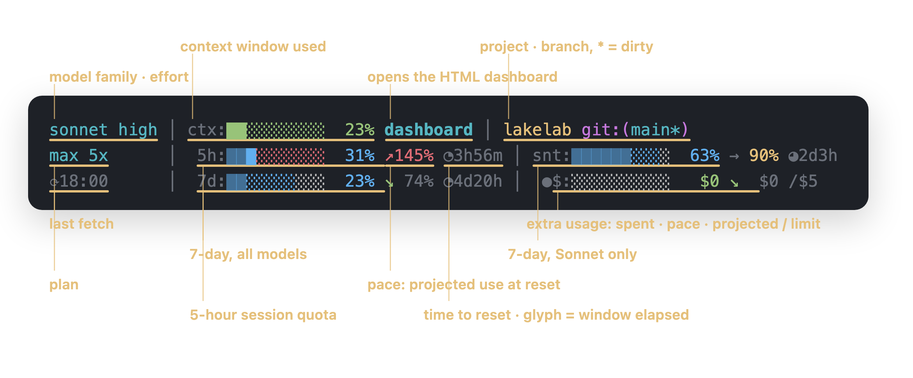
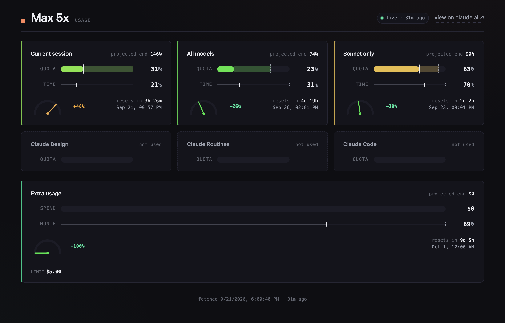

# claude-quota

**Every Claude Code quota in the statusline — session, weekly, per-model and extra usage —
with a pace arrow that says whether you will run out before the window resets.**

[](https://www.npmjs.com/package/@mmdemirbas/claude-quota)
[](LICENSE)

[Website](https://mmdemirbas.github.io/claude-quota/) ·
[npm](https://www.npmjs.com/package/@mmdemirbas/claude-quota) ·
[Source](https://github.com/mmdemirbas/claude-quota) ·
[Changelog](CHANGELOG.md) ·
[Project page](https://mdemirbas.com/en/projects/claude-quota/)

<picture>
  <source media="(prefers-color-scheme: light)" srcset="docs/statusline-light.png">
  
</picture>

Claude Code tells you about a quota when you hit it. This plugin reads the same usage API the
`/usage` page reads and keeps every bucket in view while you work: how much of each window is
used, how much of the window has elapsed, where you will land at reset if you keep going at
this rate, and what extra usage has cost so far. Three lines on a normal terminal; one line on
a short one.

## What you see



| Segment | Meaning |
|---|---|
| `sonnet high` | Model family and effort level |
| `ctx:██░░░░░░░░  23%` | Context window: a 10-cell bar and the percentage |
| `dashboard` | An OSC 8 hyperlink to the HTML dashboard (below); plain text on terminals without link support |
| `lakelab git:(main*)` | Project directory and branch; `*` means a dirty working tree |
| `max 5x` | Plan name and multiplier |
| `5h:` `7d:` `snt:` `ops:` | The 5-hour session window, the 7-day all-models window, the 7-day Sonnet and Opus windows |
| `█████░░░░░  31%` | Used share of the window |
| `↗145%` `→ 90%` `↘ 74%` | Pace: the projected share at the end of the window. Over 100 % means the quota runs out before it resets |
| `◔3h56m` | Time until reset; the glyph is how much of the window has elapsed, `○◔◑◕●` = 0 → 100 % |
| `⟳18:00` | Local time of the last successful fetch |
| `●$:` / `○$:` | Extra usage on or off |
| `  $0 ↘  $0 /$5` | Extra usage spent · pace · projected · monthly limit |

**Colour** carries the warning, so the numbers can stay small:

- Context bar: green under 70 %, yellow to 85 %, red from 85 %.
- Quota bars, filled cells: blue under 75 %, magenta to 90 %, red from 90 %. When over pace,
  the cells up to the pace line are dim and the cells past it are bright.
- Quota bars, empty cells: dim along the projected path; gray for quota that will go unused
  (projection under 100 %); red for the stretch where the quota will already be gone
  (projection at or over 100 %).
- Pace arrow: green `↘` under pace, dim `→` on pace, yellow or red `↗` over pace.
- Projection: dim to 79 %, yellow to 100 %, red beyond.
- Money: green at $0, yellow above, red from 80 % of the limit.

## Install

```bash
npm install -g @mmdemirbas/claude-quota
```

Then point the statusline at it in `~/.claude/settings.json`:

```json
{
  "statusLine": {
    "type": "command",
    "command": "claude-quota"
  }
}
```

From source instead:

```bash
git clone https://github.com/mmdemirbas/claude-quota.git
cd claude-quota
npm install
./ctl deploy link    # builds and links the global claude-quota binary to this checkout
```

After `deploy link`, every `./ctl build` takes effect immediately.

If you use `claude-hud`, disable it first so the two do not share the line:

```json
{
  "enabledPlugins": {
    "claude-hud@claude-hud": false
  }
}
```

### Requirements

- Claude Code with a Pro or Max subscription (OAuth login). API-key users get no quota line,
  because the usage API has nothing for them; the model and context line still renders.
- Node.js 18 or newer.
- macOS reads the token from the Keychain. Other systems fall back to
  `~/.claude/.credentials.json` (see the security model).

## How it works

1. Claude Code runs the plugin as a subprocess on every statusline refresh, with the session's
   context JSON on stdin.
2. The plugin reads the OAuth token Claude Code itself uses — from the macOS Keychain, or from
   the credentials file elsewhere.
3. It calls `api.anthropic.com/api/oauth/usage`. The answer is cached for 2 minutes; after
   90 seconds a background refresh starts, so a long session never shows stale numbers and
   never fetches on the hot path.
4. It renders one to three lines to stdout, sized to the terminal, and rewrites the HTML
   dashboard beside its cache.

### The dashboard



Every render also writes `~/.claude/plugins/claude-quota/dashboard.html`, so its figures are
the statusline's figures. The page polls its `data.js` every 5 seconds; leave it open in a tab
for a live view. Open it by clicking `dashboard` on line 1 (iTerm2, kitty, Ghostty, WezTerm,
VS Code's terminal, recent Windows Terminal and GNOME Terminal support OSC 8 links) or with
`open ~/.claude/plugins/claude-quota/dashboard.html`.

The link is the first thing dropped when the terminal is narrow, so the project and branch
keep their room.

### Adaptive layout

The output is measured in terminal columns and never wraps.

| Rows available | Layout |
|---|---|
| 3 or more | The three-line layout above |
| 2 | Line 1 as is; line 2 carries every quota (`5h` `7d` `snt` `ops` `$`) |
| 1 | `model │ ctx% │ 5h% │ 7d%`, no bars |

Per line, content is dropped in this order until it fits: the reset timer, then the pace and
projection, then the bar (leaving label and percentage). Line 1 degrades from
`project + branch*` to `project` to nothing. Dimensions come from `process.stderr` (still a TTY
when stdout is piped), then `$COLUMNS` / `$LINES`, then defaults.

## Troubleshooting

- **No quota line** — API-key login, a free plan, or a custom `ANTHROPIC_BASE_URL`. Usage is
  fetched only for direct Claude.ai OAuth subscribers.
- **`usage:⚠`** — the API is unreachable (network error, timeout). Cached data is shown for
  15 seconds, then the warning.
- **`⟳` stays on** — the usage API rate-limited the plugin. Last-known data is shown and the
  retry backs off from 60 seconds to 10 minutes; the glyph clears on the next successful fetch.
- **`[claude-quota] cache file rejected … reason=permissive-mode`** — a cache file written
  before the permission hardening. The plugin refuses files with group or world bits, re-fetches,
  and the next successful write is `0600`. `CLAUDE_QUOTA_SILENT=1` hides the line.

## Security model

- **Credential source.** The OAuth token comes from the macOS Keychain first, with
  `~/.claude/.credentials.json` as the fallback on other hosts. The fallback is refused unless it
  is `0600` and owned by the current user, so a token planted by another local user is never
  used.
- **Cache files.** `data.js`, `credit-grant.js`, `.profile-cache.json` and `dashboard.html`
  live under `~/.claude/plugins/claude-quota/` with mode `0600`, and the renderer refuses to read
  a cache file with broader permissions — a second local user cannot feed the dashboard.
- **Dashboard output.** Every externally sourced string (today, the plan name) is HTML-escaped
  before it reaches `dashboard.html`; a tampered API response cannot run script in the page.
- **HTTPS.** Calls to `api.anthropic.com` use Node's system trust store with TLS 1.2 as the
  floor. The leaf certificate is not pinned, because Anthropic rotates it without a published
  pin set and a hardcoded pin would eventually become an outage. Someone who can install a
  trusted CA on the host (root, admin, an MDM profile) can therefore intercept the call; the
  `0600` cache files and the HTML escaping are the defence behind that line.
- **Stderr.** Auth failures (HTTP 401/403), rejected cache files and rejected credential files
  emit one warning line. Rate limits and normal expiry stay silent. `CLAUDE_QUOTA_SILENT=1`
  disables all warnings.

The on-disk format other tools can read is specified in
[the usage cache protocol](docs/usage-cache-protocol.md).

## Development

```bash
./ctl build          # compile
./ctl test           # unit tests
./ctl deploy link    # use this checkout as the global binary
node scripts/docs-figures.mjs tmp/figures   # regenerate the README figures' HTML from the renderer
```

## License

[MIT](LICENSE)
